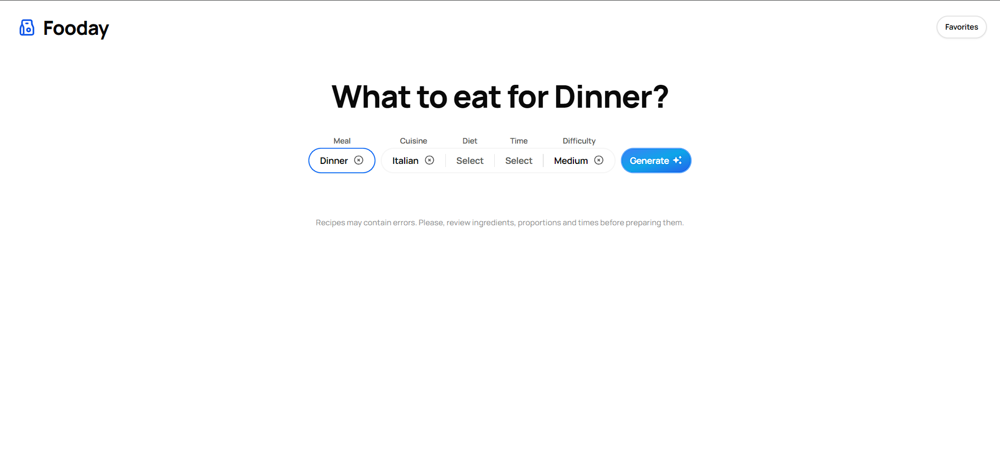

## 🥞 Fooday - Meal generator

Fooday is a simple app for generate meals with ai. it's built with:

- Nextjs
- Typescript
- Tailwind CSS
- Tabler Icons
- Zustand
- Vercel AI SDK

## ✍🏼 Features

- Generate meals and their recipes.
- Filtered generation by:
  - Meal type
  - Diet
  - Cuisine type
  - Time to cooking
  - Difficulty
- Save recipe as favorite.
- View favorite recipes.

## 🚀 Run the project

To run the project in your local environment, follow these steps:

- Clone the repository to your local machine.
- Run ``pnpm install`` in the project directory to install the required dependencies.
- Run ``pnpm run dev`` to get the project started.
